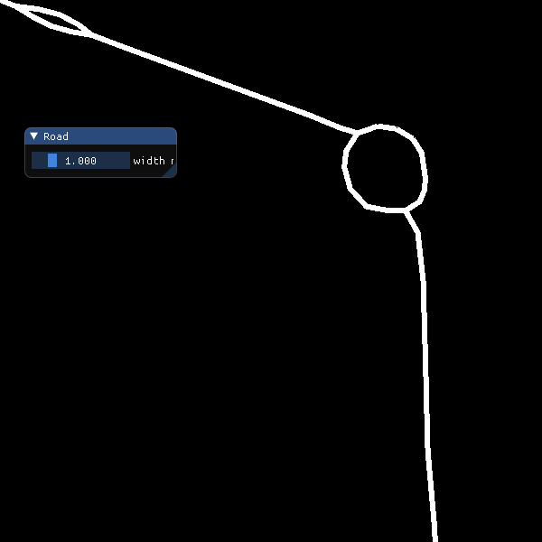
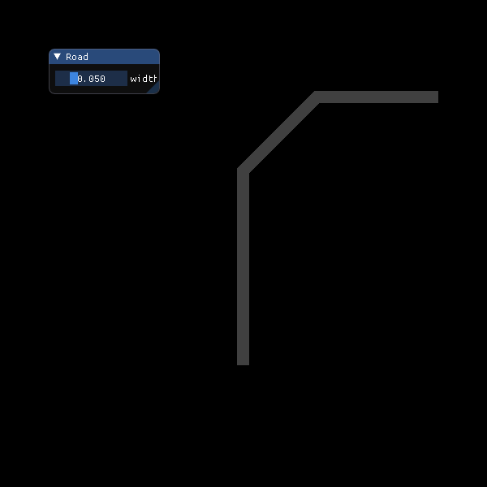

# road_render

Attempt to render road network using GPU power. It is another one of my OpenGL based mini project, see linked repositories for *graphics samples* project to see more samples like this. 

## how to build

Install *scons*, *glfw3*, *glew*, *osmium*, *expat* and *glm* library dependencies

> **Node**: On Ubuntu 19.10 this can be done with
>
> ```sh
> sudo apt install scons libglm-dev libglfw3-dev libglew-dev libosmium2-dev libexpat1-dev
> ```
>
> command.

and build with

```sh
scons -j4
```

command.

## history

We can render directly from Open Street Map data.



Three road elements rendered with simple (flat color based) road shader program in a window.




Adam Hlavatovic